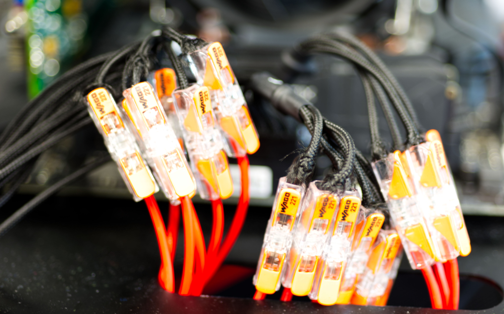

# Building a bench table for measuring GPU power consumption
In the following, we provide instructions for building a power measurement setup to be used with the library, mainly based on [Tinkerforge](https://github.com/Tinkerforge) bricklets. The setup was used for our BELIV 2022 paper "Power Overwhelming: Quantifying the Energy Cost of Visualisation".

## Disclaimer
> **Warning**
> The procedure below involves manipulating current-carrying cables in your computer!

> **Warning**
> Do not proceed if you do not have the appropriate education and/or knowledge to perform or feel uncomfortable in performing the steps described here! Special training might be required in your country in order to be allowed to perform such modifications.

> **Warning**
> The modifications described in the following will **invalidate the warranty** on the components and render them useless for normal operations.

> **Warning**
> Universität Stuttgart, VISUS and any person involved in this project do not make any warranty of the permissibility, safety and fitness for any purpose of the process described herein. We are not electrical engineers, and in no event shall we be liable for any claim, damages or other liability, arising from, out of or in connection with following the process described here. **You do that at your own risk!**

## Parts and special tools
> **Note**
> Mentioning of specific products in this guide does not constitute an endorsement of said products by Universität Stuttgart, VISUS or any person involved in this project. We are mentioning these only for your convenience and as a reference for the specific setup we built. However, other products might be similarly or better suitable for the purpose. We do not receive any commission for any of the products mentioned.

### Tools
* Soldering station
* Solder with flux
* Screwdrivers
* Side-cutting pliers
* 3D printer
* Crimp tong.
* Cable stripper, e.g. *Knipex 12 40 2000.* In principle, this is optional, but you will need to strip a lot of cables, so this is highly recommended.
* Heat gun, e.g. *Bosch GHG 20-63 Professional.* This is also optional, but if you want to use shrink tubing to insulate and mark cables, you need one.
* Label printer. This is optional, but we recommend labelling the bricklets such that you easily know what is connected to them.
* Antistatic mat and/or antistatic wrist strap. We strongly recommend using this while working with expensive electronic parts.

### PC components
* Bench table, e.g. *Lian Li PC-T70X.* You will need an open bench table, because after installing the riser card, the GPU will not fit into a PC chassis anymore.
* Power supply unit, e.g. *BeQuiet Dark Power Pro P12 1200W.* We recommend using a modular PSU for which you can purchase the PC-side cables individually such that you can try again if you made a mistake.
* PCI Express riser, e.g. *[Adex Electronics PEX16IX](http://www.adexelec.com/pex16ix).* Make sure to choose a riser that has probing/soldering points for the power lanes. You need to be able to bypass the internal power lanes of the riser and replace these with cables running through the power sensors.
* Mainboard, e.g. *ASUS ROG Strix X570-E Gaming*
* CPU, e.g. *AMD Ryzen 9 5900X*
* CPU fan, e.g. *BeQuiet Pure Rock Slim 2*
* RAM, e.g. *Crucial Ballistix Black 64GB PC3200 CL16 kit*
* Hard disk/SSD, e.g. *Samsung 980 PRO 500 GB*
* GPUs to test

### Parts
* 20 m litz wire with 1.5 mm² cross section. We recommend having half in red and half in blue/black. Depending on the placement of the components, you might need more or less wire. However, you should aim at keeping it as short as possible.
* 2 m litz wire with 2.5 mm² cross section. Again, we recommend having half in red and half in blue/black.
* 60 &times; wire connectors for wires with a cross section of up to 1.5 mm², e.g. *WAGO 221-2411.* Due to the large number of connections, we strongly recommend using revisable wire connectors instead of soldering them.
* 25 &times; 5-conductor lever nuts for wires with a cross section of up to 2.5 mm², e.g. *WAGO 221-415.*
* 4 &times; ferrule for soldering 1.5 mm² wires to the riser card.
* ??? &times; ferrule. This is only required if you intend to solder the connections. Due to the large number of connections, we strongly advise against soldering them.
* Cable tie. While optional, it facilitates the setup if you can tie wires that belong together.
* Shrink tubing in different colours. This is required to mark the wires you have cut such that you know which ones need to be connected. Alternatively, you can also use tape for that.
* Electrical tape in different colours. This is required to mark the wires you have cut sucht that you know which ones need to be connected. Alternatively, you can also use coloured shrink tubing.
* 3 &times; *[Tinkerforge Master Brick 3.1](https://www.tinkerforge.com/en/shop/master-brick.html)*
* 10 &times; *[Tinkerforge Voltage/Current Bricklet 2.0](https://www.tinkerforge.com/en/shop/voltage-current-v2-bricklet.html)* (If you plan to measure only GPUs with two PCIe power cables, nine of these will suffice.)
* 10 &times; *[Tinkerforge Bricklet Cable 50 cm (7p-7p)](https://www.tinkerforge.com/en/shop/bricklet-cable-50cm-7p-7p.html)* (If you plan to measure only GPUs with two PCIe power cables, nine of these will suffice.)
* 1 &times; *[Tinkerforge Workbench (34 &times; 20 cm)](https://www.tinkerforge.com/en/shop/tinkerforge-workbench-34x20cm.html)*
* 13 &times; *[Tinkerforge Mounting Kit 12 mm](https://www.tinkerforge.com/en/shop/accessories/mounting/mounting-kit-12mm.html)*
* 1 m (or longer) USB-C to USB-C cable or USB-C to USB-A cable.

## Instructions
1. Assemble the bench table.

    Consult the manual of your bench table. Some tables come with bezels detached that must be screwed to the body before the computer components can be installed.

2. Assemble the computer on the bench table. Refer to the manual of your mainboard for detailed instructions. Typically, the following steps are necessary:
    1. Attach the mainboard to the bench table using the spacers provided with the mainboard.

        Nowadays, there is usually no need to install a back plate for the CPU fan, but you may want to check the manual of your fan whether it requires installation of one *before* the mainboard is screwed to the bench table.

    4. Mount the CPU in its socket.

        Consult the manual for instructions and make sure that the marker in one of the corner of the CPU and the marker on the socket match. The markers might be rather subtle.

    5. Install the CPU fan.

        Consult the manual for instructions. Some fans require special brackets to be installed on the mainboard. In any case, apply some heat paste (about the size of a pea), which should come with the fan, on the centre of the CPU before pressing the fan on it. Make sure to tighten the screws iteratively in alternating order.

        In some cases, the CPU is very close to the memory slots and a large CPU fan will make it difficult to reach the slots. You might want to install the memory before installing the fan in this case.

    6. Install the RAM modules.

        If you do not install a module in every slot, consult the manual which ones should be used.

    7. Install the hard disk.

        SATA disks are fairly easy to connect with the respective cables.

        M.2 SSDs might have a dedicated heat sink that must be removed from the mainboard before they can be installed. Consult the manual for instructions.

        On some mainboards, PCIe lanes are shared between M.2 SSDs and the PCIe slots. Consult the manual to find out which M.2 slot and which PCIe slot for the GPU you should used to avoid conflicts. You want to make sure that both can work with the full bandwidth available.

    8. Install the GPU.
    9. Install the power supply unit (PSU).

        On most bench table, the PSU is mounted on the bottom layer of the table below the mainboard.

    10. Connect all the cables for switches, USB, etc. as described in the manual of the mainboard.
    11. Connect all power cables and test the machine.

3. Build the Tinkerforge setup:

    <picture>
        
    </picture>

    1. Assemble the workbench (or just use a flat mounting plate).

        Using the workbench has the advantage that it is raised and you can route the large number of wires below the bricklets.

    2. Assemble the stack of the Master Bricks using the spacers somewhere close to the middle of the plate.
    3. Assemble the bricklets using the spacers on the mounting plate.

        Leave sufficient space around each of them such that you can route the power wires. Ideally, the bricklets are placed over or next to the opening in the plate such that you can route the power wires below the plate.

    4. Connect the bricklets using the 7p-7p cables to the stack of master bricks.

        Start at the bottom of the stack. The bottommost master brick is the one that will be connected to the computer via USB and the higher the stack is, the worse becomes the latency.

    5. Connect the bottommost master brick via USB to a computer, which could be the bench table.
    6. Install the [Brick Daemon](https://www.tinkerforge.com/en/doc/Software/Brickd.html) and the [Brick Viewer](https://www.tinkerforge.com/en/doc/Software/Brickv.html#brickv) on the computer.

        Regardless of whether you have attached any device to any of the *Voltage/Current Bricklets*, you should be able to enumerate all of the bricklets in the *Brick Viewer*.

    7. We recommend printing labels for the individual bricklets such that you know which one is which.

        The easiest way to find out the UIDs of the bricklets is opening each of them in the *Brick Viewer* one after the other and flashing their status LED from there.

4. Cut the ATX power wires.
    1. Identify the relevant pins on the cable using a trustworthy source, for instance the manual of your mainboard or [Wikipedia](https://en.wikipedia.org/wiki/ATX#Power_supply).

       > **Warning**
       > Double check whether the diagram shows the socket or the wire before cutting any wire! The diagrams in the manual typically show the pins on the mainboard-side socket, not on the cable/plug side. You can identify this by matching the shapes (squared or rounded) of the heads or receptacles shown with the heads you want to cut.

        Assuming the 24-pin ATX power supply connector, the pins are (i) four 3.3 V cables on pins 1, 2, 12 and 13, (ii) five 5 V cables on pins 4, 6, 21, 22 and 23 and (iii) two 12 V cables on pins 10 and 11.

    2. Cut the wires in two. The location does not matter much, but we recommend cutting about 50 mm from the connector attached to the mainboard for later accessibility of the cut. Ideally, the remaining wire is long enough to reach the Tinkerforge bricklets without an additional extension.

    3. In order to identify the ends when putting them together later, you want to *immediately* tie the wires to each voltage together using cable tie on both sides of the cut and mark them with a unique colour (either shrink tubing or tape).

    4. Remove the insulation on both sides of the cut. 

        Consult the manual of your lever nuts or ferrules on how much of the insulation you need to remove. For the WAGO lever nuts we used, 11 mm are recommended.

    5. If you intend to solder the wires instead of using level nuts, add the ferrules to the end of the wires.

5. Cut the EPS P4/P8 CPU power wires.
    1. Identify the relevant pins on the cable using a trustworthy source, for instance the manual of your mainboard or the manual of your power supply.

       > **Warning**
       > Double check whether the diagram shows the socket or the wire before cutting any wire! The diagrams in the manual typically show the pins on the mainboard-side socket, not on the cable/plug side. You can identify this by matching the shapes (squared or rounded) of the headers or receptacles shown with the heads you want to cut.

        For a P4 connector, there are two 12 V cables on pins 3 and 4 and two ground cables on pins 1 and 2. The 12 V pins should be *on the side of the clamp* that holds the connector in place.

        For a P8 connector, there are four 12 V cables on pins 5, 6, 7 and 8 and four ground cables on pins 1, 2, 3 and 4. The 12 V pins should be *on the side of the clamp* that holds the connector in place.

    2. Cut the wires in two. The location does not matter much, but we recommend cutting about 50 mm from the connectors attached to the mainboard for later accessibility of the cut. Ideally, the remaining wire is long enough to reach the Tinkerforge bricklets without an additional extension

    3. In order to identify the ends when putting them together later, you want to *immediately* tie the wires to each voltage together using cable tie on both sides of the cut and mark them with a unique colour (either shrink tubing or tape).

    4. Remove the insulation on both sides ot the cut.

        Consult the manual of your lever nuts or ferrules on how much of the insulation you need to remove. For the WAGO lever nuts we used, 11 mm are recommended.

    5. If you intend to solder the wires instead of using level nuts, add the ferrules to the end of the wires.

6. Cut the PCIe power wires.
    1.  Identify the relevant pins on the cable using a trustworthy source, for instance the manual of your mainboard, the manual of your power supply or [Wikipedia](https://en.wikipedia.org/wiki/PCI_Express#Power).

        > **Warning**
        > Double check whether the diagram shows the socket or the cable before cutting any wire! You can identify this by matching the shapes (squared or rounded) of the headers or receptacles shown with the heads you want to cut.

        > **Warning**
        > The 8-pin connectors are frequently realised as a 6-pin connector and a 2-pin connector. Make sure that you arranged these correctly before cutting any wire!

        For a 6-pin connector, there are three 12 V cables on pins 1, 2 and 3 and two ground cables on pins 4 and 6. The 12 V pins should be *opposite of the side of the clamp* that holds the connector in place.
        
        For an 8-pin connector, there are three 12 V cables on pins 1, 2 and 3 and three ground cables on pins 5, 7 and 8. The ground pins should be *on the side of the clamp* that holds the connector in place.

    2. Cut the wires in two. The location does not matter much, but we recommend cutting about 50 mm from the connectors attached to the GPU for later accessibility of the cut. Ideally, the remaining wire is long enough to reach the Tinkerforge bricklets without an additional extension

    3. In order to identify the ends when putting them together later, you want to *immediately* tie the cables to each voltage together using cable tie on both sides of the cut and mark them with a unique colour (either shrink tubing or tape).

    4. Remove the insulation on both sides ot the cut.

        Consult the manual of your lever nuts or ferrules on how much of the insulation you need to remove. For the WAGO lever nuts we used, 11 mm are recommended.

    5. If you intend to solder the wiress instead of using level nuts, add the ferrules to the end of the wires.
  
7. Prepare the riser card for soldering by removing the pluggable fuses for the 3.3 V and 12 V rails.

    The following picture illustrates the fuses that need to be removed from the B side of an *Adex Electronics PEX16IX* we used. The remaining fuse is for 5 V.
    
    > **Warning**
    > The illustration is specific for the very revision of the *Adex Electronics PEX16IX* we used. Consult the manual of your hardware to identify the correct fuses to remove!

    > **Warning**
    > The fuses are most likely not identical (on the *Adex Electronics PEX16IX*, they definitely are not). Remember which one you removed from which location in case you ever want to restore the original configuration of the riser.

    <picture>
        
    </picture>

8. Prepare the four wires with 1.5 mm² cross section for the PEG power rails of the riser.

    The length of the wires depends on the application scenarios you want to cover: If you intend only using the Tinkerforge bricklets for measuring, you can determine the length such that you directly reach the bricklets. If you intend to only measure using oscilloscopes, you can solder a loop (two cables) directly on the riser that is long enough that you can put a current clamp around it. If you want to have both options, you can use short wires at the riser that you can either connect into a loop or extend to reach the bricklets.

    Add ferrules on the side you intend to solder to the riser.

    The other side does not need ferrules as it is either clamped into a bricklet or into a wire connector.

9. Solder extension wires to the riser.

    Consult the manual of your riser to identify the pins where to attach the wires. In case of the *Adex Electronics PEX16IX*, there are pins for an external power supply and pins for supplying power via PEG. You must make sure to connect the pins for supplying power via PEG.

    We strongly recommend to *immediately* add some identification in form of coloured tape or shrink tubing to each of the four wires such that you know which pair is 3.3 V/12 V and which of these are input and output.

    <picture>
        
    </picture>

10. Prepare the extension wires with 1.5 mm² cross section for ATX, EPS P4/P8 and the PCIe cables.

    We recommend measuring the required wires once you have assembled the Tinkerforge bricks and bricklets and have decided on where to place them. The wires should be as long as necessary, but as short as possible.

    When deciding the length of the PCIe power wires, remember that some GPUs might be higher than others, so make sure to test it with your biggest card or do not make the wires too tight.

    The insulation needs to be removed on both sides of the extension wires. Consult the manual of your lever nuts or ferrules on how much of the insulation you need to remove. For the WAGO lever nuts we used, 11 mm are recommended.

11. Prepare the wires (2.5 mm² cross section) for connecting the extension cables to the bricklets (8 &times; 2 = 16 for each of the two colours).

    The *Voltage/Current Bricklets* cannot accept the number of wires required, for instance, 5 &times; 1.5 mm² for the 5 V ATX rail. Therefore, we use a single wire with a larger cross section here.

    As the wire cross section that fits into a *Voltage/Current Bricklet* is smaller than the sum of some connections, these wire should be as short as possible. We found 50 mm to work for us.

    Remove the insulation on both sides of these short wires. On the side that is connected to the bricklet, remove around 10 mm. Consult the manual of your lever nuts or ferrules on how much of the insulation you need to remove on the other side. For the WAGO lever nuts we used, 11 mm are recommended.

12. Connect the extension wires for ATX, EPS P4/P8 and the PCIe cables.

    You can either solder these connections or use revisable wire connectors (recommended). On the sides of the (mainboard, GPU) connectors, we connected each wire individually using *WAGO 221-2411* wire connectors.

    <picture>
        
    </picture>

12. Connect the extension wires for ATX, EPS P4/P8 and the PCIe cables to the 2.5 mm² wires connecting to the bricklets.

    We strongly recommend using lever nuts for these connections. A single *WAGO 221-415* 5-conductor lever nut suffices for almost any connection. Attach all of the 1.5 mm² extension wires and the single 2.5 mm² wire of each connection into a single lever nut.

    <picture>
        
    </picture>

    The 5 V ATX rail uses five wires and therefore does not fit into a single *WAGO 221-415* along with the 2.5 mm² connection to the bricklet. In this single case, we stack two of the lever nuts:

    <picture>
        
    </picture>

13. Connect the 2.5 mm² wires to the bricklets.

    > **Warning**
    > The direction of the current matters for *Voltage/Current Bricklets!* Check the arrow indicating the direction of the current and the labels "input" and "output" printed on the bricklet.

    Connect the "input" side of the bricklets to the power supply and the "output" side to the extension cables for the consumers (mainboard and GPU).

    <picture>
        
    </picture>

13. Connect the wires soldered to the riser to the bricklets.

    > **Warning**
    > The direction of the current matters for *Voltage/Current Bricklets!* Check the arrow indicating the direction of the current and the labels "input" and "output" printed on the bricklet.

    > **Warning**
    > Check the direction of the current through the riser in the manual.

    In case of the *Adex Electronics PEX16IX*, the lower pins (closer to the PCIe slot) are the source that needs to be connected to the "input" side of the bricklet and the upper pins are the sink that needs to be connected to the "output" side.

    Unless used with *Isolator Bricklets,* *Voltage/Current Bricklets 2.0* are not galvanically isolated from the overall Tinkerforge system, i.e. they are grounded via the master bricks. If you want to connect the bricklets to the ground of the riser card, you can do so by preparing additional wires with alligator clamps that attach to the grounding point of the riser.

At this point, you should be ready to perform your first measurements. We have compiled a [list of lessons learned for the software side](/docs/TINKERFORGE.md).
